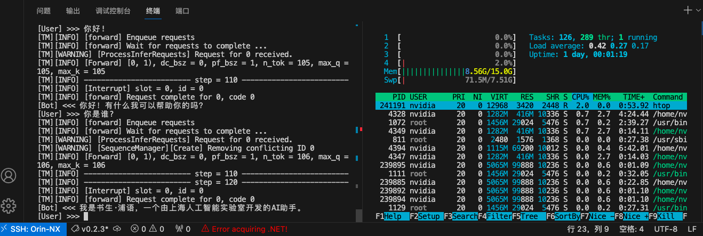

# S7.Run InternLM offline on Jetson

Create directory to save models.

```sh
mkdir -p ~/models
```

Upload the `internlm-chat-7b-turbomind.tgz` obtained from [S1.Quantize on server by W4A16](./s1.md) to the `models` directory.

Unzip the model.

```sh
tar zxvf internlm-chat-7b-turbomind.tgz -C .
```

### 1.CLI Mode

Acitavate conda environment：

```sh
conda activate lmdeploy
```

Run model.

```sh
lmdeploy chat turbomind ./internlm-chat-7b-turbomind
```


### 2.Python Mode

Write a running script `run_model.py` with the following content:

```py
from lmdeploy import turbomind as tm


if __name__ == "__main__":
    model_path = "./internlm-chat-7b-turbomind" # 修改成你的路径

    tm_model = tm.TurboMind.from_pretrained(model_path)
    generator = tm_model.create_instance()

    while True:
        inp = input("[User] >>> ")
        if inp == "exit":
            break
        prompt = tm_model.model.get_prompt(inp)
        input_ids = tm_model.tokenizer.encode(prompt)
        for outputs in generator.stream_infer(session_id=0, input_ids=[input_ids]):
            res = outputs[1]
        response = tm_model.tokenizer.decode(res)
        print("[Bot] <<< {}".format(response))

```

Activate conda environment：

```sh
conda activate lmdeploy
```

Run the script：

```sh
python run_model.py
```




### 3.Bug fix: Modify the MMEngine module.

The PyTorch version on Jetson does not support distributed reduce operations, which may cause errors in the distributed parts of the MMEngine module.

Error as:

```sh
AttributeError: module 'torch.distributed' has no attribute 'ReduceOp'
```

Activate conda environment：

```sh
conda activate lmdeploy
```

Run Python in interpreter mode:

```sh
python
```

Enter the following content:

```py
import mmengine
print(mmengine.__file__)
```

It will output the installation location of the MMEngine module. The author's location is`/home/nvidia/miniconda3/envs/lmdeploy/lib/python3.8/site-packages/mmengine/__init__.py`，then the location of that is`home/nvidia/miniconda3/envs/lmdeploy/lib/python3.8/site-packages/mmengine/`.Let's use `<path/to/mmengine>` instead.

Modify line 208 of `<path/to/mmengine>/logging/logger.py`.

```git
- global_rank = _get_rank()
+ global_rank = 0
```

There will be no errors during operation.

**Attention * *: This method is too crude and only applicable to Jetson platform deployment inference. It will affect distributed functionality on the server side!


