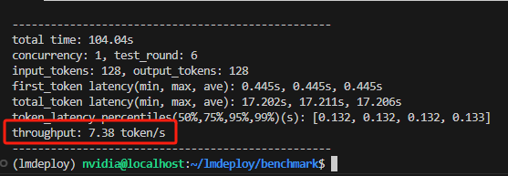

# LMDeploy-Jetson基准测试

请首先参考S2-S7在Jetson部署LMDeploy。

激活conda环境。

```sh
conda activate lmdeploy
```

进入`lmdeploy/benchmark`目录。

```sh
cd ~/lmdeploy/benchmark
```

运行Benchmark。

```sh
python profile_generation.py \
    <path/to/your/model>/internlm2-chat-1_8b-turbomind \
    --concurrency 1 \
    --prompt-tokens 128 \
    --completion-tokens 128
```

其中`internlm2-chat-1_8b-turbomind`更换为你的模型路径。

记录推理速度benchmark。



推理过程中，可通过`htop`命令查看统一内存占用情况。

```sh
# htop安装方法（如已安装，请忽略）
apt-get install htop

# 运行htop，查看Mem
htop
```