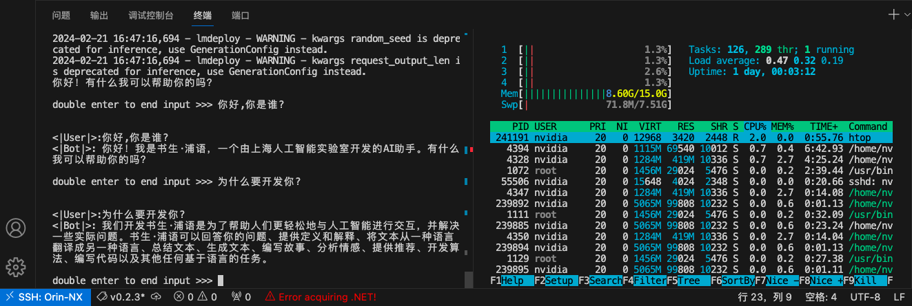
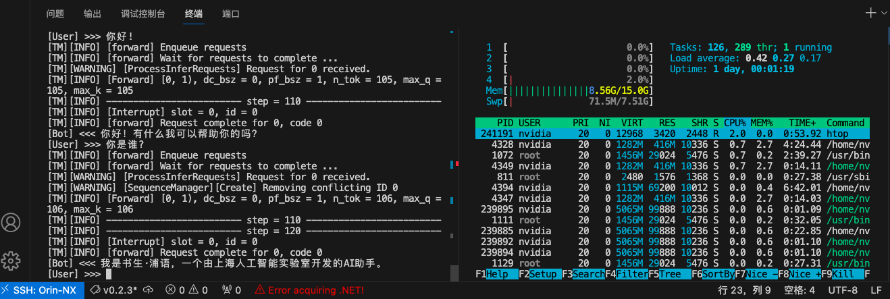

# S7.Jetson端离线运行InternLM大模型

创建模型保存目录：

```sh
mkdir -p ~/models
```

将[S1.服务器端模型W4A16量化](./s1.md)得到的`internlm-chat-7b-turbomind.tgz`上传到`models`目录下。

解压模型文件：

```sh
tar zxvf internlm-chat-7b-turbomind.tgz -C .
```

### 1.终端运行

激活conda环境：

```sh
conda activate lmdeploy
```

运行模型：

```sh
lmdeploy chat turbomind ./internlm-chat-7b-turbomind
```



### 2.Python集成运行

编写运行脚本`run_model.py`，内容如下：

```py
from lmdeploy import turbomind as tm


if __name__ == "__main__":
    model_path = "./internlm-chat-7b-turbomind" # 修改成你的路径

    tm_model = tm.TurboMind.from_pretrained(model_path)
    generator = tm_model.create_instance()

    while True:
        inp = input("[User] >>> ")
        if inp == "exit":
            break
        prompt = tm_model.model.get_prompt(inp)
        input_ids = tm_model.tokenizer.encode(prompt)
        for outputs in generator.stream_infer(session_id=0, input_ids=[input_ids]):
            res = outputs[1]
        response = tm_model.tokenizer.decode(res)
        print("[Bot] <<< {}".format(response))

```

激活conda环境：

```sh
conda activate lmdeploy
```

运行脚本：

```sh
python run_model.py
```




### 3.Bug解决：修改MMEngine库

Jetson端的pytorch不支持分布式的reduce算子，这会导致MMEngine库中与分布式有关的部分出现错误。

错误为：

```sh
AttributeError: module 'torch.distributed' has no attribute 'ReduceOp'
```

激活conda环境：

```sh
conda activate lmdeploy
```

用解释器方式运行python：

```sh
python
```

输入如下内容：

```py
import mmengine
print(mmengine.__file__)
```

这就输出了MMEngine库的安装位置，笔者的是`/home/nvidia/miniconda3/envs/lmdeploy/lib/python3.8/site-packages/mmengine/__init__.py`，那么相应位置就是`home/nvidia/miniconda3/envs/lmdeploy/lib/python3.8/site-packages/mmengine/`，咱们用`<path/to/mmengine>`代替。

修改`<path/to/mmengine>/logging/logger.py`第208行：

```git
- global_rank = _get_rank()
+ global_rank = 0
```

在运行就不会报错了。

**注意**：该方式过于粗暴，仅适用于Jetson平台部署推理，在服务器端会影响分布式功能！


